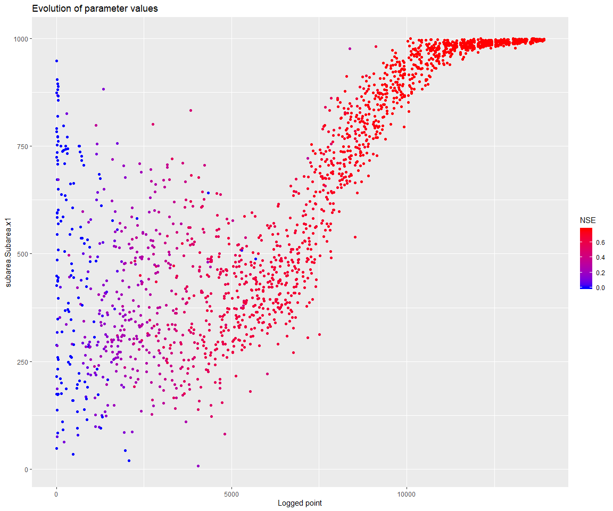

# mhplot

An R package to visualise the outputs from optimisation algorithms

See [this vignette](https://csiro-hydroinformatics.github.io/streamflow-forecasting-tools-onboard/blob/master/doc/vignettes/getting_started/getting_started.md) for a sample usage in hydrology.